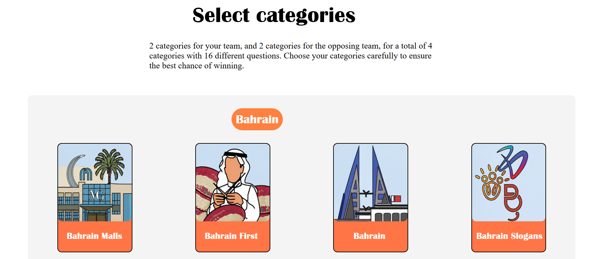

# seenjeem 

## User Stories
1. As a player , I want to see a welcome section to know how to start the game
2. As a player , I want to choose my own category for both teams
3. As a player , I want to choose my team name
4. As a player , I want to read the question so i can answer it
5. As a player , I want to be able to click the answer by clicking the button
6. As a player , I want to know immediately if my answer was correct or no 
7. As a player , I want to know the correct answer after answring
8. As a player , I want my score to be updated after each question
9. As a player , I want a timer in each question (countdown)
10. As a player, I want to choose which team receives the point.
11. As a player , I want to see the final score at the end of the game
12. As a player , I want to be able to reset the agem at any time

## technologies used:
1. HTML
2. CSS
3. JS

## Description:
SeenJeem is a fun, interactive quiz game . Players compete in teams by answering diffrent types of questions from different categories to earn points. The team with the highest score at the end wins!🏆

## Screenshots

